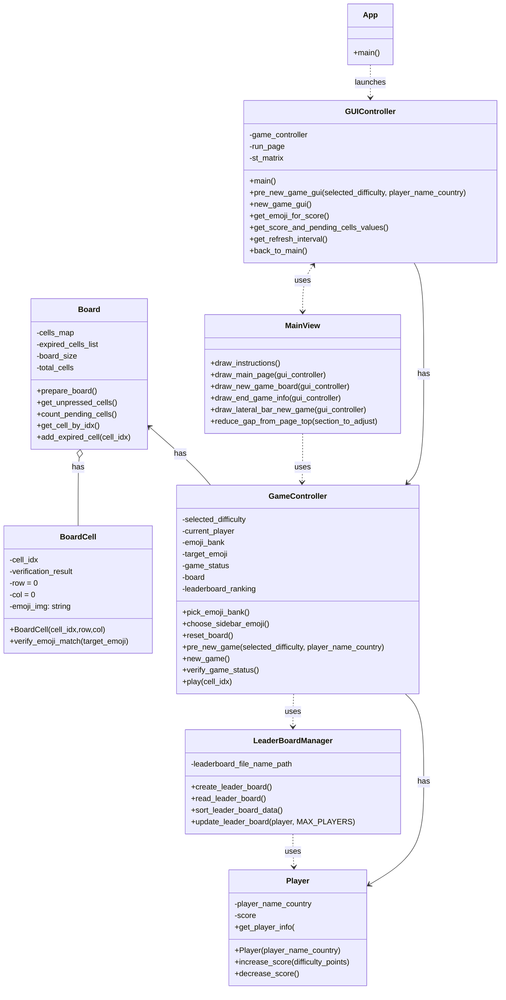
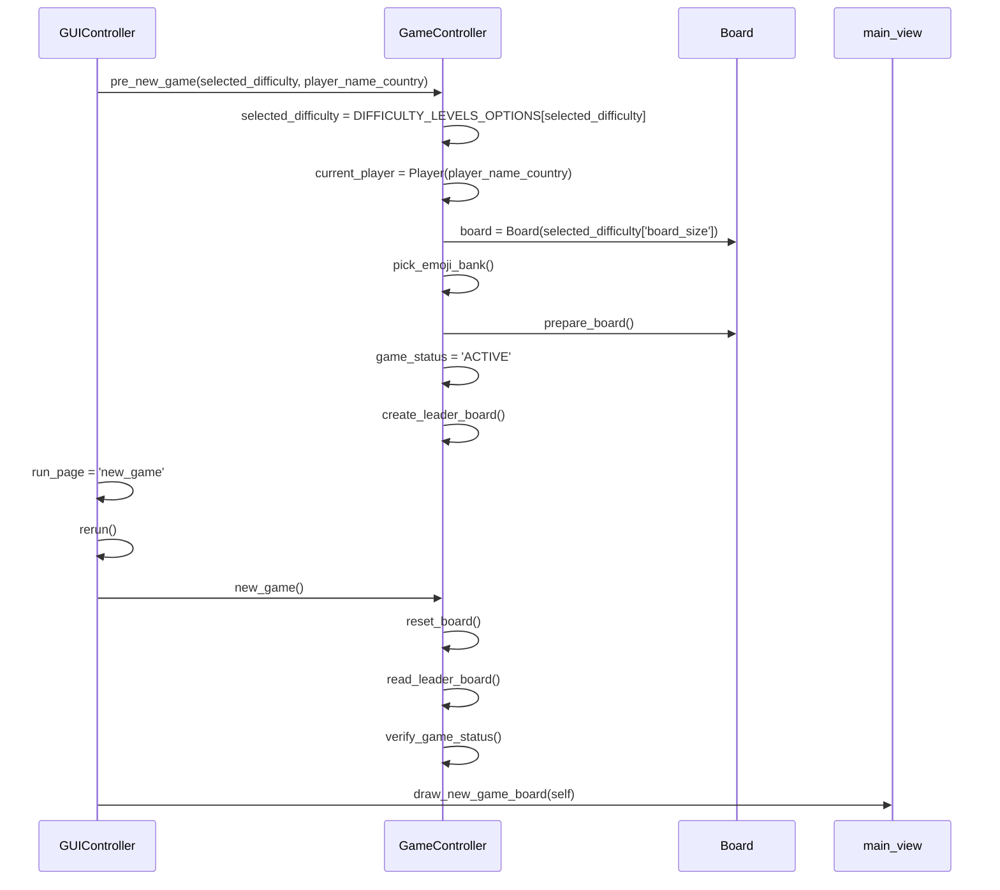

# Ejercicio de migración parte 2

## Migración a objetos

### Objetivo

Incorporar el paradigma de programación orientada a objetos (OOP) y transformar la aplicación en una aplicación en
Streamlit
para favorcer la mantenibilidad del código fuente.

## Código original

* Ver el código fuente del proyecto https://github.com/shakamoushie/pixmatch/blob/main/pixmatch.py . Este proyecto tiene
  un clone del proyecto original
* Interactuar con el juego para entener las funcionalidades principales https://pixmatchgame.streamlit.app
* Instalar el proyecto en su computador local. Escriba desde la línea de comandos y ubicado en la carpeta raíz del
  proyecto `pip install -r requirements.txt`. Note que si no tiene un ambiente virtual primero debe configurarlo.
* Ejecutar el juego localmente. Escriba en consola `streamlit run docs/legacy_version/pixmatch.py`. Su navegador debería
  abrir el juego
  

## Código orientado a objetos

* Este código fuente cumple las mismas funcionalidades que el código legacy pero tiene orientación a objetos
* **Análisis del código actual**
    * Compare la lógica del método ```PreNewGame``` en el código original y en el nuevo código orientado a objetos.
      Identifique como esta separada la lógica relacionada con la visualización con la lógica de negocio
    * Identifique en la versión orientada a objetos en qué puntos se controla la lectura y escritura del leaderboard.
      Considere que una restricción es que solo se escribe y se lee el leaderboard si el jugador escribe su nombre

### Por hacer

1. Agregar lógica para que si el jugador a fallado en más del 50% + 1 de las celdas el juego termine
2. Ajuste el código para que el leaderboard sea de cuatro jugadores. Observe la diferencia entre ajustarlo en el código
   anterior y en esta nueva versión de código. Note como un diseño mejorado facilita el mantenimiento
2. Agregar nueva página para que cuando se gana se muestre una página con un mensaje grande que indica que el jugador ha
   ganado y los globos. En esta página se debe mostrar el puntaje del jugador, y un botón para reiniciar un nuevo juego
   (Pagina limpia)

3. Agregar un bonus aleatorio en alguna celda del juego. Este bonus cambia de posición en cada interacción y cuando se
   descubre suma 5 puntos al puntaje del jugador. Si el bonus se descubre se le avisa al jugador y se vuelve a ubicar en
   las celdas que no han sido destapadas, siempre y cuando falten más del 20% de las celdas por destapar. El botón que
   destapó el bonus debe tener un icono que lo identifique
4. Ajustar parametrización de dificultad para poder cambiar el tamaño del tablero predefinido por dificultad
5. Ajustar parametrización inicial para activar o desactivar el autorefresco de la página. Por defecto debe estar
   desactivado
6. **RETO:** Me gustaría que los botones que muestran los emojis fueran más grandes. Esto implica interacción con html. ¿Cómo
   haría esto?

## Diagrama del proyecto



Editor:https://diagrams.helpful.dev/s/s:MAdFfNUs

### Diagrama de secuencia que representa la interacción cuando se da click en new game
